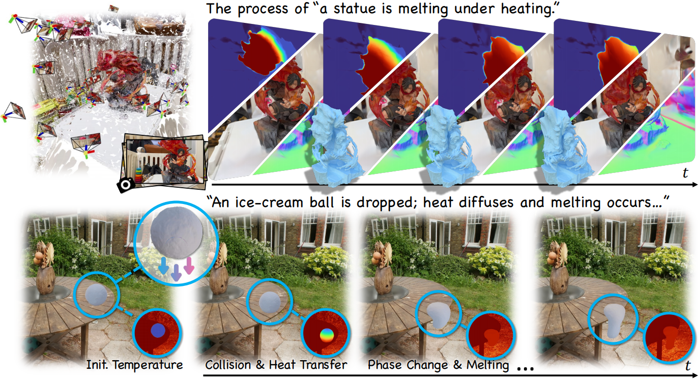
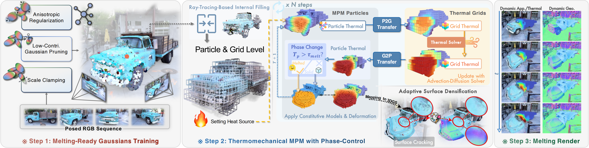

# [ECCV 2026] MeGAS: Thermomechanical Dynamic Gaussian Splatting for Thermophysical Scene Editing


### [Project Page](https://zju3dv.github.io/MeGAS/) | [Paper](https://zju3dv.github.io/MeGAS/sources/pdf/ECCV26-MeGAS.pdf) | [Arxiv](https://arxiv.org/abs/2606.23455) | [Video](https://www.youtube.com/watch?v=wAaGvaGSkGU)

> [MeGAS: Thermomechanical Dynamic Gaussian Splatting for Thermophysical Scene Editing](https://zju3dv.github.io/MeGAS/), \
> Zesong Yang*, Yuanhang Lei*, Liyuan Cui, Yihang Chen, Jiaer Huang, Boming Zhao, Peter Yichen Chen, Hujun Bao, Zhaopeng Cui†


Abstract: *Recent advances integrate physically grounded Newtonian dynamics with neural rendering frameworks, narrowing the gap between photorealistic scene reconstruction and physics-based animation. However, existing approaches focus on mechanically driven dynamics while neglecting temperature, a fundamental yet invisible physical factor underlying phenomena such as melting, solidification, and other thermomechanical processes. In this paper, we propose MeGAS, a novel framework that incorporates thermomechanical phase-change dynamics into 3D Gaussian Splatting (3DGS). Specifically, we propose a new thermomechanical dynamic Gaussian Splatting representation that augments 3DGS with temperature attributes and employs a heat advection-diffusion solver with MPM dynamics incorporating phase transitions, enabling physically plausible and visually realistic synthesis of thermophysical phenomena. Furthermore, a new topology-adaptive Gaussian rendering strategy is proposed to mitigate cracking and floaters under extreme deformation. Extensive experiments demonstrate that MeGAS produces physically consistent thermomechanical behavior while maintaining high-fidelity photorealistic rendering, advancing toward physics-integrated world models.*


## Method Overview


## ToDos
🔥 Feel free to raise any requests~
- [x] Release project page.
- [x] Release paper.
- [ ] Release codes.

## Acknowledgement
Some codes are modified from [PhysGaussian](https://github.com/XPandora/PhysGaussian), [Warp-MPM](https://github.com/zeshunzong/warp-mpm), thanks for the authors for their valuable works.

### Citation

If you find this code useful for your research, please use the following BibTeX entry.

```
@inproceedings{yang2025megas,
 title={MeGAS : Thermomechanical Dynamic Gaussian Splatting for Thermophysical Scene Editing},
 author={Yang, Zesong and Lei, Yuanhang and Cui, Liyuan and Chen, Yihang and Huang, Jiaer and Zhao, Boming and Chen, Peter Yichen and Bao, Hujun and Cui, Zhaopeng},
 booktitle={European Conference on Computer Vision (ECCV)},
 year={2026}
}
           
```